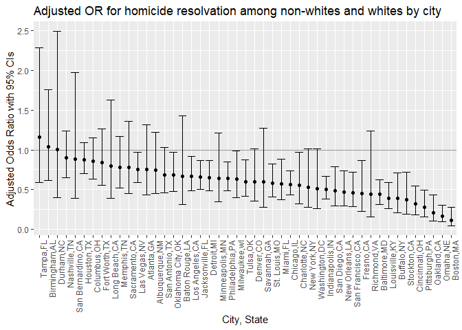
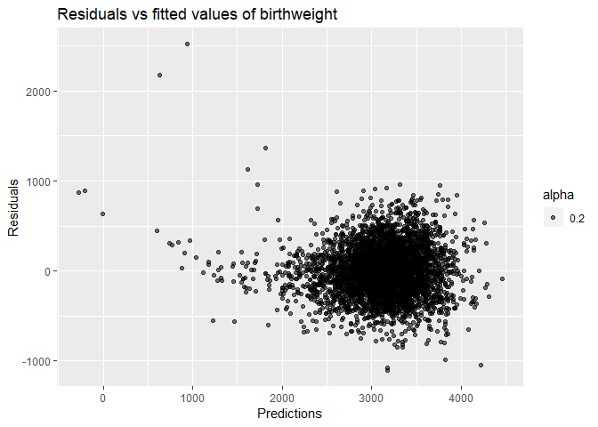
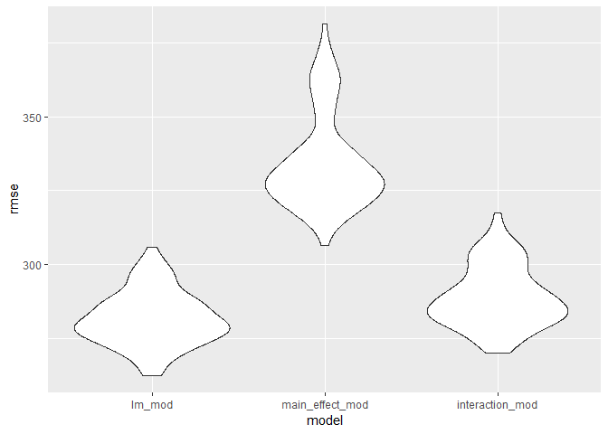

p8105\_hw6\_rh2916
================
Rui Huang
November 16, 2018

### Problem 1

``` r
df_homicide = read.csv("./data/homicide-data.csv") %>% 
  janitor::clean_names() %>% 
  mutate(city_state = paste(city, state, sep = ","),
         sloving_status = ifelse(disposition == "Closed by arrest", 1, 0)) %>%
  filter(city_state != "Dallas,TX" & city_state != "Phoenix,AZ" & city_state != "Kansas City,MO" & city_state != "Tulsa,AL") %>%
  mutate(victim_race = ifelse(victim_race == "White", "white","non_white"),
         victim_race = fct_relevel(victim_race,"white", "non_white"),
         victim_age = as.numeric(victim_age))
```

For the city of Baltimore, MD, use the glm function to fit a logistic
regression with resolved vs unresolved as the outcome and victim age,
sex and race (as just defined) as predictors. Save the output of glm as
an R object; apply the broom::tidy to this object; and obtain the
estimate and confidence interval of the adjusted odds ratio for solving
homicides comparing non-white victims to white victims keeping all other
variables fixed.

``` r
Baltimore_homicide =
  df_homicide %>% 
  filter(city_state == "Baltimore,MD") 
  
glm_sloving_status = glm(sloving_status ~ victim_age + victim_sex + victim_race, data = Baltimore_homicide, family = binomial())

save(glm_sloving_status,file = "./homicide_balti.rdata")

glm_sloving_status %>% 
  broom::tidy() %>% 
  mutate(OR = exp(estimate),
         log_OR = estimate,
         OR_lower = exp(estimate - std.error * 1.96),
         OR_upper = exp(estimate + std.error * 1.96)) %>%
  select(term, log_OR, OR, OR_lower, OR_upper, p.value) %>% 
  knitr::kable(digits = 3)
```

| term                   | log\_OR |    OR | OR\_lower | OR\_upper | p.value |
| :--------------------- | ------: | ----: | --------: | --------: | ------: |
| (Intercept)            |   1.047 | 2.850 |     1.828 |     4.443 |   0.000 |
| victim\_age            | \-0.004 | 0.996 |     0.990 |     1.002 |   0.217 |
| victim\_sexMale        | \-0.885 | 0.413 |     0.316 |     0.539 |   0.000 |
| victim\_racenon\_white | \-0.793 | 0.453 |     0.322 |     0.637 |   0.000 |

Now run glm for each of the cities in your dataset, and extract the
adjusted odds ratio (and CI) for solving homicides comparing non-white
victims to white victims. Do this within a “tidy” pipeline, making use
of purrr::map, list columns, and unnest as necessary to create a
dataframe with estimated ORs and CIs for each city.

``` r
func_solving = function(x){
  
city_homicide = df_homicide %>%
  filter(city_state == x) 
  
glm_sloving_status = glm(sloving_status ~  victim_age + victim_sex + victim_race, data = city_homicide, family = binomial()) 

glm_sloving_status %>% 
  broom::tidy() %>% 
  filter(term == "victim_racenon_white") %>%
  mutate(OR = exp(estimate),
         log_OR = estimate,
         OR_lower = exp(estimate - std.error * 1.96),
         OR_upper = exp(estimate + std.error * 1.96)) %>%
  select(term, log_OR，OR, OR_lower, OR_upper, p.value)
}


glm_city = purrr::map_df(.x = unique(df_homicide$city_state), func_solving) %>%
  mutate(term = unique(df_homicide$city_state)) %>%
  select(term, OR, OR_lower, OR_upper)

knitr::kable(glm_city)
```

| term              |        OR | OR\_lower | OR\_upper |
| :---------------- | --------: | --------: | --------: |
| Albuquerque,NM    | 0.6860531 | 0.4176936 | 1.1268280 |
| Atlanta,GA        | 0.7667500 | 0.4404260 | 1.3348567 |
| Baltimore,MD      | 0.4525206 | 0.3216183 | 0.6367017 |
| Baton Rouge,LA    | 0.6558545 | 0.3074060 | 1.3992734 |
| Birmingham,AL     | 1.0471153 | 0.6226868 | 1.7608378 |
| Boston,MA         | 0.1205147 | 0.0496317 | 0.2926313 |
| Buffalo,NY        | 0.4474175 | 0.2454991 | 0.8154098 |
| Charlotte,NC      | 0.5550724 | 0.3250622 | 0.9478352 |
| Chicago,IL        | 0.5751690 | 0.4412468 | 0.7497377 |
| Cincinnati,OH     | 0.3269424 | 0.1896816 | 0.5635305 |
| Columbus,OH       | 0.8844860 | 0.6571143 | 1.1905319 |
| Denver,CO         | 0.5942632 | 0.3530832 | 1.0001856 |
| Detroit,MI        | 0.6609813 | 0.4958055 | 0.8811848 |
| Durham,NC         | 1.1528002 | 0.4605854 | 2.8853462 |
| Fort Worth,TX     | 0.8527376 | 0.5646679 | 1.2877683 |
| Fresno,CA         | 0.4574375 | 0.2364785 | 0.8848546 |
| Houston,TX        | 0.9207334 | 0.7385825 | 1.1478069 |
| Indianapolis,IN   | 0.5162217 | 0.3904393 | 0.6825258 |
| Jacksonville,FL   | 0.6805895 | 0.5192906 | 0.8919900 |
| Las Vegas,NV      | 0.7883387 | 0.6133272 | 1.0132894 |
| Long Beach,CA     | 0.8428440 | 0.4125229 | 1.7220522 |
| Los Angeles,CA    | 0.7176698 | 0.5245393 | 0.9819092 |
| Louisville,KY     | 0.4336608 | 0.2880092 | 0.6529710 |
| Memphis,TN        | 0.8066744 | 0.5410201 | 1.2027715 |
| Miami,FL          | 0.5768849 | 0.3792360 | 0.8775438 |
| Milwaukee,wI      | 0.6598363 | 0.4218651 | 1.0320454 |
| Minneapolis,MN    | 0.6665973 | 0.3546769 | 1.2528361 |
| Nashville,TN      | 0.8919720 | 0.6483472 | 1.2271420 |
| New Orleans,LA    | 0.5105893 | 0.3258175 | 0.8001456 |
| New York,NY       | 0.5481259 | 0.2883199 | 1.0420439 |
| Oakland,CA        | 0.2174194 | 0.1066208 | 0.4433582 |
| Oklahoma City,OK  | 0.7114617 | 0.5034389 | 1.0054403 |
| Omaha,NE          | 0.1795682 | 0.0993418 | 0.3245838 |
| Philadelphia,PA   | 0.6615811 | 0.4997369 | 0.8758399 |
| Pittsburgh,PA     | 0.2896680 | 0.1657606 | 0.5061971 |
| Richmond,VA       | 0.4882646 | 0.1827811 | 1.3043051 |
| San Antonio,TX    | 0.6983376 | 0.4686070 | 1.0406917 |
| Sacramento,CA     | 0.7743855 | 0.4470755 | 1.3413235 |
| Savannah,GA       | 0.6437600 | 0.3135537 | 1.3217096 |
| San Bernardino,CA | 0.9462056 | 0.4259329 | 2.1019859 |
| San Diego,CA      | 0.4339041 | 0.2668553 | 0.7055240 |
| San Francisco,CA  | 0.4577118 | 0.2901059 | 0.7221505 |
| St. Louis,MO      | 0.6010156 | 0.4239120 | 0.8521103 |
| Stockton,CA       | 0.3954507 | 0.2078289 | 0.7524517 |
| Tampa,FL          | 1.1845998 | 0.6121601 | 2.2923361 |
| Tulsa,OK          | 0.5857297 | 0.4021869 | 0.8530344 |
| Washington,DC     | 0.5268148 | 0.2666526 | 1.0408066 |

Create a plot that shows the estimated ORs and CIs for each city.
Organize cities according to estimated OR, and comment on the plot.

``` r
ggplot(glm_city, aes(x=reorder(term, -OR),y=OR))+
  geom_point() +
  geom_errorbar(aes(ymin = OR_lower, ymax = OR_upper)) +
  geom_hline(yintercept = 1, alpha = 0.4) +
  theme(legend.position = "bottom", axis.text.x = element_text(angle = 90, hjust = 1), legend.key.width = unit(0.15,'cm')) +
  labs(
    title = "Adjusted OR for homicide resolvation among non-whites and whites by city",
    x = "City, State",
    y = "Adjusted Odds Ratio with 95% CIs"
  )
```

<!-- -->

``` r
  ggtitle('Adjusted Odds Ratio with 95% CIs for each city')
```

    ## $title
    ## [1] "Adjusted Odds Ratio with 95% CIs for each city"
    ## 
    ## $subtitle
    ## NULL
    ## 
    ## attr(,"class")
    ## [1] "labels"

### Problem 2

Load and clean the data for regression analysis

``` r
df_birthweight_raw = read.csv("./data/birthweight.csv")

df_birthweight = 
  df_birthweight_raw %>% 
  janitor::clean_names() %>% 
  mutate(babysex = as.factor(babysex),
         frace = as.factor(frace),
         mrace = as.factor(mrace),
         malform = as.factor(malform))

skimr::skim(df_birthweight)
```

    ## Skim summary statistics
    ##  n obs: 4342 
    ##  n variables: 20 
    ## 
    ## -- Variable type:factor -------------------------------------------------------------------------------
    ##  variable missing complete    n n_unique                      top_counts
    ##   babysex       0     4342 4342        2         1: 2230, 2: 2112, NA: 0
    ##     frace       0     4342 4342        5 1: 2123, 2: 1911, 4: 248, 3: 46
    ##   malform       0     4342 4342        2           0: 4327, 1: 15, NA: 0
    ##     mrace       0     4342 4342        4 1: 2147, 2: 1909, 4: 243, 3: 43
    ##  ordered
    ##    FALSE
    ##    FALSE
    ##    FALSE
    ##    FALSE
    ## 
    ## -- Variable type:integer ------------------------------------------------------------------------------
    ##  variable missing complete    n      mean     sd  p0  p25    p50  p75 p100
    ##     bhead       0     4342 4342   33.65     1.62  21   33   34     35   41
    ##   blength       0     4342 4342   49.75     2.72  20   48   50     51   63
    ##       bwt       0     4342 4342 3114.4    512.15 595 2807 3132.5 3459 4791
    ##     delwt       0     4342 4342  145.57    22.21  86  131  143    157  334
    ##   fincome       0     4342 4342   44.11    25.98   0   25   35     65   96
    ##  menarche       0     4342 4342   12.51     1.48   0   12   12     13   19
    ##   mheight       0     4342 4342   63.49     2.66  48   62   63     65   77
    ##    momage       0     4342 4342   20.3      3.88  12   18   20     22   44
    ##    parity       0     4342 4342    0.0023   0.1    0    0    0      0    6
    ##   pnumlbw       0     4342 4342    0        0      0    0    0      0    0
    ##   pnumsga       0     4342 4342    0        0      0    0    0      0    0
    ##      ppwt       0     4342 4342  123.49    20.16  70  110  120    134  287
    ##    wtgain       0     4342 4342   22.08    10.94 -46   15   22     28   89
    ##      hist
    ##  <U+2581><U+2581><U+2581><U+2581><U+2585><U+2587><U+2581><U+2581>
    ##  <U+2581><U+2581><U+2581><U+2581><U+2581><U+2587><U+2581><U+2581>
    ##  <U+2581><U+2581><U+2581><U+2583><U+2587><U+2587><U+2582><U+2581>
    ##  <U+2581><U+2587><U+2585><U+2581><U+2581><U+2581><U+2581><U+2581>
    ##  <U+2581><U+2582><U+2587><U+2582><U+2582><U+2582><U+2581><U+2583>
    ##  <U+2581><U+2581><U+2581><U+2581><U+2582><U+2587><U+2581><U+2581>
    ##  <U+2581><U+2581><U+2581><U+2585><U+2587><U+2582><U+2581><U+2581>
    ##  <U+2582><U+2587><U+2585><U+2582><U+2581><U+2581><U+2581><U+2581>
    ##  <U+2587><U+2581><U+2581><U+2581><U+2581><U+2581><U+2581><U+2581>
    ##  <U+2581><U+2581><U+2581><U+2587><U+2581><U+2581><U+2581><U+2581>
    ##  <U+2581><U+2581><U+2581><U+2587><U+2581><U+2581><U+2581><U+2581>
    ##  <U+2581><U+2587><U+2586><U+2581><U+2581><U+2581><U+2581><U+2581>
    ##  <U+2581><U+2581><U+2581><U+2587><U+2587><U+2581><U+2581><U+2581>
    ## 
    ## -- Variable type:numeric ------------------------------------------------------------------------------
    ##  variable missing complete    n  mean   sd    p0   p25   p50   p75 p100
    ##   gaweeks       0     4342 4342 39.43 3.15 17.7  38.3  39.9  41.1  51.3
    ##     ppbmi       0     4342 4342 21.57 3.18 13.07 19.53 21.03 22.91 46.1
    ##    smoken       0     4342 4342  4.15 7.41  0     0     0     5    60  
    ##      hist
    ##  <U+2581><U+2581><U+2581><U+2581><U+2583><U+2587><U+2581><U+2581>
    ##  <U+2581><U+2587><U+2585><U+2581><U+2581><U+2581><U+2581><U+2581>
    ##  <U+2587><U+2581><U+2581><U+2581><U+2581><U+2581><U+2581><U+2581>

Propose a regression model for birthweight. Use backward

``` r
full_model = lm(bwt ~ ., data = df_birthweight)
summary(full_model)
```

    ## 
    ## Call:
    ## lm(formula = bwt ~ ., data = df_birthweight)
    ## 
    ## Residuals:
    ##      Min       1Q   Median       3Q      Max 
    ## -1097.68  -184.86    -3.33   173.09  2344.15 
    ## 
    ## Coefficients: (3 not defined because of singularities)
    ##               Estimate Std. Error t value Pr(>|t|)    
    ## (Intercept) -6265.3914   660.4011  -9.487  < 2e-16 ***
    ## babysex2       28.7073     8.4652   3.391 0.000702 ***
    ## bhead         130.7781     3.4523  37.881  < 2e-16 ***
    ## blength        74.9536     2.0217  37.075  < 2e-16 ***
    ## delwt           4.1007     0.3948  10.386  < 2e-16 ***
    ## fincome         0.2898     0.1795   1.614 0.106551    
    ## frace2         14.3313    46.1501   0.311 0.756168    
    ## frace3         21.2361    69.2960   0.306 0.759273    
    ## frace4        -46.9962    44.6782  -1.052 0.292912    
    ## frace8          4.2969    74.0741   0.058 0.953745    
    ## gaweeks        11.5494     1.4654   7.882 4.06e-15 ***
    ## malform1        9.7650    70.6259   0.138 0.890039    
    ## menarche       -3.5508     2.8951  -1.226 0.220083    
    ## mheight         9.7874    10.3116   0.949 0.342588    
    ## momage          0.7593     1.2221   0.621 0.534418    
    ## mrace2       -151.4354    46.0453  -3.289 0.001014 ** 
    ## mrace3        -91.3866    71.9190  -1.271 0.203908    
    ## mrace4        -56.4787    45.1369  -1.251 0.210901    
    ## parity         95.5411    40.4793   2.360 0.018307 *  
    ## pnumlbw             NA         NA      NA       NA    
    ## pnumsga             NA         NA      NA       NA    
    ## ppbmi           4.3538    14.8913   0.292 0.770017    
    ## ppwt           -3.4716     2.6121  -1.329 0.183913    
    ## smoken         -4.8544     0.5871  -8.269  < 2e-16 ***
    ## wtgain              NA         NA      NA       NA    
    ## ---
    ## Signif. codes:  0 '***' 0.001 '**' 0.01 '*' 0.05 '.' 0.1 ' ' 1
    ## 
    ## Residual standard error: 272.5 on 4320 degrees of freedom
    ## Multiple R-squared:  0.7183, Adjusted R-squared:  0.717 
    ## F-statistic: 524.6 on 21 and 4320 DF,  p-value: < 2.2e-16

``` r
step_model = step(full_model, direction = "both", trace = FALSE)
summary(step_model)
```

    ## 
    ## Call:
    ## lm(formula = bwt ~ babysex + bhead + blength + delwt + fincome + 
    ##     gaweeks + mheight + mrace + parity + ppwt + smoken, data = df_birthweight)
    ## 
    ## Residuals:
    ##      Min       1Q   Median       3Q      Max 
    ## -1097.18  -185.52    -3.39   174.14  2353.44 
    ## 
    ## Coefficients:
    ##               Estimate Std. Error t value Pr(>|t|)    
    ## (Intercept) -6098.8219   137.5463 -44.340  < 2e-16 ***
    ## babysex2       28.5580     8.4549   3.378 0.000737 ***
    ## bhead         130.7770     3.4466  37.944  < 2e-16 ***
    ## blength        74.9471     2.0190  37.120  < 2e-16 ***
    ## delwt           4.1067     0.3921  10.475  < 2e-16 ***
    ## fincome         0.3180     0.1747   1.820 0.068844 .  
    ## gaweeks        11.5925     1.4621   7.929 2.79e-15 ***
    ## mheight         6.5940     1.7849   3.694 0.000223 ***
    ## mrace2       -138.7925     9.9071 -14.009  < 2e-16 ***
    ## mrace3        -74.8868    42.3146  -1.770 0.076837 .  
    ## mrace4       -100.6781    19.3247  -5.210 1.98e-07 ***
    ## parity         96.3047    40.3362   2.388 0.017004 *  
    ## ppwt           -2.6756     0.4274  -6.261 4.20e-10 ***
    ## smoken         -4.8434     0.5856  -8.271  < 2e-16 ***
    ## ---
    ## Signif. codes:  0 '***' 0.001 '**' 0.01 '*' 0.05 '.' 0.1 ' ' 1
    ## 
    ## Residual standard error: 272.3 on 4328 degrees of freedom
    ## Multiple R-squared:  0.7181, Adjusted R-squared:  0.7173 
    ## F-statistic: 848.1 on 13 and 4328 DF,  p-value: < 2.2e-16

Plot the final model with predictions and
residuals

``` r
lm_model = lm(bwt ~ bhead + babysex + blength + delwt + gaweeks + wtgain + smoken, data = df_birthweight)

df_birthweight %>% 
  modelr::add_predictions(lm_model) %>% 
  modelr::add_residuals(lm_model) %>% 
  ggplot(aes(x=pred,y=resid))+
  geom_point(aes(alpha=.2))+
  labs(
    title = "Residuals vs fitted values of birthweight",
    x = "Predictions", y = "Residuals"
  )
```

<!-- -->

Making two more models, main\_effect\_model contains length at birth and
gestational age as predictors, interaction\_model contains head
circumference, length, sex, and all interactions as predictors

``` r
main_effect_model = lm(bwt ~ blength + gaweeks, data = df_birthweight)
interaction_model = lm(bwt ~ bhead + blength + babysex + bhead * blength * babysex, data = df_birthweight)
```

Compare my model to two others by Cross-validation

``` r
cv_df = 
  crossv_mc(df_birthweight, 100)

cv_df = cv_df %>% 
  mutate(train = map(train, as_tibble),
         test = map(test, as_tibble)) %>% 
  mutate(lm_mod = map(train,~lm(bwt ~ bhead + babysex + blength + delwt + gaweeks + wtgain + smoken, data=.x)),
         main_effect_mod = map(train, ~lm(bwt~blength+gaweeks,data=.x)),
         interaction_mod = map(train, ~lm(bwt~bhead + blength + babysex + bhead * blength * babysex, data=.x))) %>% 
  mutate(rmse_lm_mod = map2_dbl(lm_mod,test, ~rmse(model = .x, data=.y)),
         rmse_main_effect_mod = map2_dbl(main_effect_mod,test, ~rmse(model = .x, data=.y)),
         rmse_interaction_mod = map2_dbl(interaction_mod,test, ~rmse(model = .x, data=.y))) 
```

plot the RMSEs

``` r
cv_df %>% 
  select(starts_with("rmse")) %>% 
  gather(key = model, value = rmse) %>% 
  mutate(model = str_replace(model, "rmse_", ""),
         model = fct_inorder(model)) %>% 
  ggplot(aes(x = model, y = rmse)) + geom_violin()
```

<!-- -->
